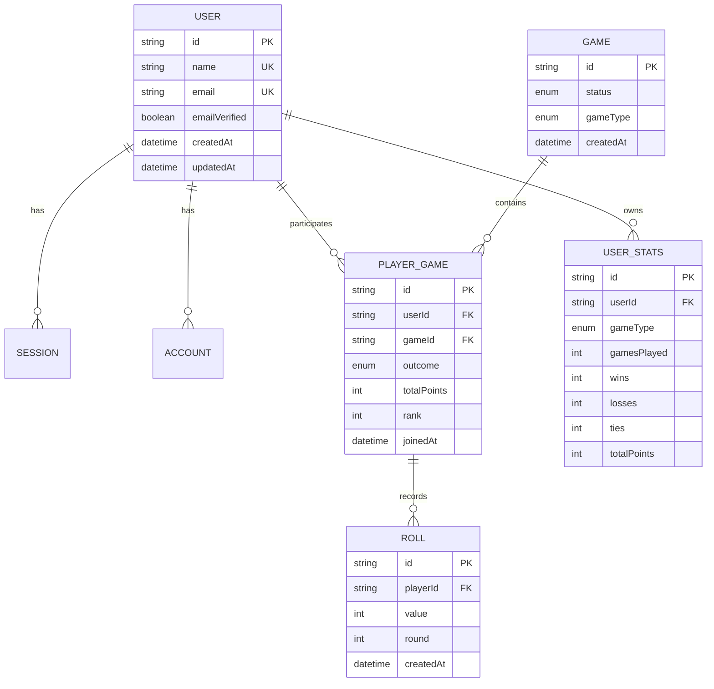

*This project has been created as part of the 42 curriculum by @lgracia, @pamanzan, @jgirbau-, @amarquez, @ecoma-ba.*

# Transcendence

## Description

Transcendence is a full-stack, real-time multiplayer dice game. Players authenticate, choose a game mode, create or join a room, ready up, and play synchronously against other players. The project combines a responsive Next.js interface, a Socket.IO game server, PostgreSQL persistence, and a containerized HTTPS setup.

### Key features

- Email/password authentication and GitHub OAuth through Better Auth.
- Profile completion and editing, avatar selection, and account information.
- Multiplayer rooms with five-character codes and a maximum of six players.
- Two game modes: Free Play and Add42.
- Server-authoritative turns, dice rolls, room state, win conditions, and tie resolution.
- One d6 roll per turn, with a 30-second turn timeout.
- Temporary reconnection support for active waiting rooms and matches.
- Persistent match results, per-mode statistics, and separate leaderboards.
- Responsive desktop and mobile navigation, including a mobile bottom bar.
- Animated 3D dice presentation using Babylon.js.
- Local HTTPS routing through Traefik.

## Team Information

- **@lgracia - Project Manager and Frontend Developer:** coordinates delivery, implements user-facing pages and navigation, and contributes to responsive UI and client-side state management.
- **@pamanzan - Team Lead and Frontend Developer:** coordinates technical work, plans and tracks tasks, and contributes to the game interface and client-side experience.
- **@jgirbau- - Backend Developer:** implements the Socket.IO server, room lifecycle, turn handling, reconnection behavior, and server-side game rules.
- **@amarquez - Database and Authentication Developer:** maintains the Prisma/PostgreSQL model, authentication and session flows, OAuth integration, and user statistics persistence.
- **@ecoma-ba - DevOps and Infrastructure Engineer:** maintains Docker Compose orchestration, Traefik routing, local certificate generation, and deployment support.

Roles overlap where the feature required coordination between frontend, backend, database, and infrastructure work.

## Project Management

The team divided the project by ownership areas while reviewing integration points together. Frontend, backend, database/authentication, and infrastructure work were developed in parallel and connected through shared interfaces such as socket events, Prisma models, and the Docker network.

- **Work organization:** responsibilities were assigned by technical area; features were integrated and manually tested through the complete login-to-match flow.
- **Task tracking:** Git branches and repository history were used to organize implementation work and review changes.
- **Communication:** the team used direct team communication for coordination, clarification, and integration decisions.

The README intentionally documents only the project-management practices that are safe and relevant to the public repository.

## Technical Stack

### Frontend

- Next.js 16 App Router, React 19, and TypeScript.
- Tailwind CSS 4, custom CSS modules, and `lucide-react` for UI elements.
- Babylon.js for the animated 3D dice scene.
- Socket.IO Client for live room and match updates.
- Zod for input validation.

### Backend

- Node.js, Express 5, and Socket.IO 4.
- TypeScript executed through `tsx` and `nodemon` during development.
- `jose` and `jsonwebtoken` for token-related validation.
- A server-side game model with Factory and Strategy-style rule objects.

### Database and persistence

- PostgreSQL 17 stores users, sessions, accounts, verification records, games, players, rolls, and statistics.
- Prisma 7 provides the schema, migrations, generated client, relations, and transactional updates.

PostgreSQL was chosen because the project has relational data and integrity constraints: users participate in games, games contain players, players own rolls, and statistics are unique per user and game mode. Prisma makes these relations explicit and keeps database access type-safe.

### Infrastructure

- Docker and Docker Compose isolate the database, Next.js app, Socket.IO server, Traefik, and the external tunnel client.
- Traefik 3.7 terminates local HTTPS and routes the frontend, socket server, and dashboard by hostname.
- OpenSSL generates the local development certificate used by the HTTPS entrypoint.

## Instructions

### Prerequisites

- Linux or another Docker-compatible operating system.
- Docker Engine and Docker Compose.
- GNU Make.
- OpenSSL for local certificate generation.
- A project runtime configuration supplied separately from this public README. Credentials and private integration values are intentionally not documented here.

### Start the application

1. Obtain the repository and enter its root directory.
2. Make sure the private runtime configuration has been provided through the team's normal deployment process.
3. Run the following command:

   ```bash
   make up
   ```

   This generates the local certificate when necessary, starts PostgreSQL, applies Prisma migrations from the application container, and starts the application services.

4. Open `https://dice.eina.cc` in a browser. A browser warning can appear because the local certificate is not issued by a public certificate authority.

### Useful commands

```bash
make re       # rebuild images and start the stack
make down     # stop and remove running containers
make clean    # remove containers, images, and project volumes
make fclean   # clean and prune unused Docker resources
make prune    # perform fclean and prune builder cache
```

## Architecture

```text
Browser
  |
  +--> Traefik HTTPS router
		 |--> Next.js App Router and Better Auth
		 |       |
		 |       +--> Prisma --> PostgreSQL
		 |
		 +--> Socket.IO game server
				 |
				 +--> in-memory waiting/match rooms
				 +--> Prisma --> PostgreSQL
```

Important boundaries:

- `next/app/`, `next/components/`, and `next/hooks/` provide pages, UI, and socket-driven client behavior.
- `server/sockets/` authenticates socket connections and broadcasts room events.
- `server/game/` owns dice generation, turn progression, room state, and win rules.
- `prisma/` defines the persistent relational model and migrations.
- `docker-compose.yml`, `traefik/`, and `certs/` provide local service orchestration and routing.

## Database Schema

The following diagram summarizes the relations in `prisma/schema.prisma`:



Additional authentication tables are `Session`, `Account`, `Verification`, and `Jwks`. `UserStats` is unique for each `(userId, gameType)` pair. `PlayerGame` is unique for each `(userId, gameId)` pair, and each player participation can have many `Roll` records.

## Features List

| Feature | Contributors | Functionality |
| --- | --- | --- |
| Authentication | @amarquez, @lgracia | Email/password sign-up and login, Better Auth sessions, and GitHub OAuth. |
| Profiles | @amarquez, @lgracia, @pamanzan | Complete a profile, edit user information, choose an avatar, and view statistics. |
| Room creation and joining | @jgirbau-, @pamanzan, @lgracia | Create a room for a selected mode, join by room code, leave, and receive live player updates. |
| Ready and lobby flow | @jgirbau-, @pamanzan, @lgracia | Lock player selection and start only when all players are ready. |
| Free Play | @jgirbau- | Accumulate one d6 result per turn and decide the winner after a full turn cycle. |
| Add42 | @jgirbau- | Lock players above 42, win on exactly 42, or resolve the closest valid score. |
| Real-time gameplay | @jgirbau-, @pamanzan | Authenticate sockets, validate turns, broadcast rolls, and synchronize state. |
| Reconnection and timeout handling | @jgirbau- | Restore active players after a short disconnect window and lock a player after 30 seconds. |
| 3D dice interface | @lgracia, @pamanzan | Present dice selection and animated rolls with Babylon.js. |
| Leaderboards | @amarquez, @lgracia, @jgirbau- | Display per-mode rankings based on persistent user statistics. |
| Responsive interface | @lgracia, @pamanzan | Provide desktop navigation and mobile layouts for the main game flows. |
| Containerized HTTPS deployment | @ecoma-ba | Run services through Docker Compose and route them through Traefik. |

## Modules

The project claims the following modules from the subject. Major modules are worth 2 points and Minor modules are worth 1 point.

**Total claimed: 14 points**

- Major modules: 6 x 2 points = 12 points.
- Minor modules: 2 x 1 point = 2 points.

### Major modules

| Subject module | Points | Implementation and justification | Contributors |
| --- | ---: | --- | --- |
| **Web: Use a framework for both the frontend and backend** | 2 | The frontend uses Next.js with the App Router, while the real-time backend uses Express. Together they provide structured routing, server/client application boundaries, HTTP server setup, and a maintainable full-stack architecture. | @lgracia, @pamanzan, @jgirbau- |
| **Web: Implement real-time features using WebSockets or similar technology** | 2 | Socket.IO broadcasts room membership, ready states, match state, dice rolls, turn changes, timeouts, and match results. The server validates socket tokens, handles disconnects, and allows players to reconnect during the disconnection window. | @jgirbau-, @pamanzan |
| **Gaming and user experience: Implement a complete web-based game** | 2 | Transcendence provides a complete playable dice game with two modes, clear turn rules, server-side roll validation, win/loss/tie outcomes, and a browser interface for creating, joining, and playing matches. `DiceGame`, `Rules`, `Product`, and `RoomManager` separate the game responsibilities. | @jgirbau-, @lgracia, @pamanzan |
| **Gaming and user experience: Remote players** | 2 | Players on separate clients join the same Socket.IO room and play the same match through synchronized server state. Disconnect handling, reconnection, turn timeouts, and server-authoritative validation address the network and fairness requirements. | @jgirbau-, @pamanzan |
| **Gaming and user experience: Multiplayer game (more than two players)** | 2 | Waiting rooms accept up to six players. Turns advance through all active players, locked players are skipped when appropriate, and every state transition is broadcast to the complete room. | @jgirbau-, @pamanzan |
| **Gaming and user experience: Implement advanced 3D graphics** | 2 | Babylon.js is used for the interactive 3D dice experience, including dice models, camera/scene rendering, selection, and animated throws. This gives the game a dedicated 3D presentation rather than a purely 2D result display. | @lgracia, @pamanzan |

### Minor modules

| Subject module | Points | Implementation and justification | Contributors |
| --- | ---: | --- | --- |
| **Web: Use an ORM for the database** | 1 | Prisma defines the PostgreSQL schema, relations, migrations, generated clients, unique constraints, and transactional persistence for games, players, rolls, and statistics. | @amarquez |
| **User Management: Implement remote authentication with OAuth 2.0** | 1 | Better Auth integrates GitHub as an external authentication provider and stores the associated account and session data in PostgreSQL. | @amarquez |

### Module scope and exclusions

Only fully implemented modules are included in the point total. The following subject modules are intentionally not claimed:

- **Standard user management and authentication:** the project has secure sign-up/login, profiles, and avatars, but the subject module also requires adding/removing friends and displaying friend online status. Those requirements are not implemented in the current schema or application flow.
- **Game statistics and match history:** the project persists game outcomes and displays leaderboards, but the subject requires a complete match history with opponents, dates, achievements, and progression. The current implementation does not provide all of those requirements.
- **Modules of choice:** no additional custom module is claimed. The dice game, real-time multiplayer, remote players, and 3D graphics are documented under the subject's existing Gaming and user experience modules rather than presented as custom modules.
- **Infrastructure and HTTPS:** Docker Compose, Traefik, and local HTTPS support the mandatory deployment and security requirements, but they are not counted as a Devops module because the subject's Devops modules require ELK, Prometheus/Grafana, microservices, or the specified health-check and disaster-recovery system.

## Individual Contributions

### @lgracia

Led project delivery and contributed the main frontend experience: navigation, responsive pages, profile and user-facing flows, client-side state handling, and integration of the game interface. A key challenge was keeping desktop and mobile interaction models consistent; shared layouts and dedicated mobile navigation components address that split.

### @pamanzan

Coordinated frontend work and contributed to the lobby, gameplay presentation, responsive behavior, and client-side synchronization. The main integration challenge was presenting server-driven room and match state clearly; the UI consumes Socket.IO events and reflects readiness, turns, rolls, and results.

### @jgirbau-

Implemented the real-time backend and game core: Socket.IO authentication, waiting and match rooms, room codes, player readiness, turn validation, dice rolls, timeout handling, reconnection, and Free Play/Add42 rules. The main challenge was keeping all clients consistent while enforcing rules server-side; room state is owned by the server and broadcast after every state transition.

### @amarquez

Implemented the Prisma schema, PostgreSQL integration, Better Auth persistence, account/session relations, OAuth support, and statistics updates. The main challenge was connecting authentication identities to game participation and leaderboard data; the schema uses explicit foreign keys, unique constraints, and transactional match updates.

### @ecoma-ba

Implemented the local deployment layer: Docker Compose services, PostgreSQL container orchestration, Traefik HTTPS routing, certificate generation, and deployment support. The main challenge was making multiple services communicate consistently; the Compose network and health-checked database startup define the service dependencies.

## Resources

### Documentation and references

- [42 Transcendence subject](https://cdn.intra.42.fr/pdf/pdf/146455/en.subject.pdf)
- [Next.js documentation](https://nextjs.org/docs)
- [React documentation](https://react.dev/)
- [TypeScript handbook](https://www.typescriptlang.org/docs/)
- [Socket.IO documentation](https://socket.io/docs/v4/)
- [Prisma documentation](https://www.prisma.io/docs)
- [PostgreSQL documentation](https://www.postgresql.org/docs/)
- [Better Auth documentation](https://www.better-auth.com/docs)
- [Babylon.js documentation](https://doc.babylonjs.com/)
- [Docker Compose documentation](https://docs.docker.com/compose/)
- [Traefik documentation](https://doc.traefik.io/traefik/)

These references were used to understand framework APIs, authentication, relational persistence, real-time communication, 3D rendering, container orchestration, and reverse-proxy configuration. Third-party dependencies retain their respective licenses. Project-specific visual assets should be credited according to their original licenses when redistributed.

### Use of AI

AI tools were used as development assistance for targeted codebase exploration, debugging hypotheses, TypeScript and React implementation suggestions, README structure, and technical writing. They were also used to help review the consistency of the documented architecture against the source files. The team reviewed, adapted, and tested generated suggestions; AI was not used as a substitute for ownership of the design, integration, or final validation of the project.

## License and Credits

This repository is an educational project created for the 42 curriculum. Frameworks, libraries, Docker images, and external assets remain subject to their own licenses and attribution requirements.

